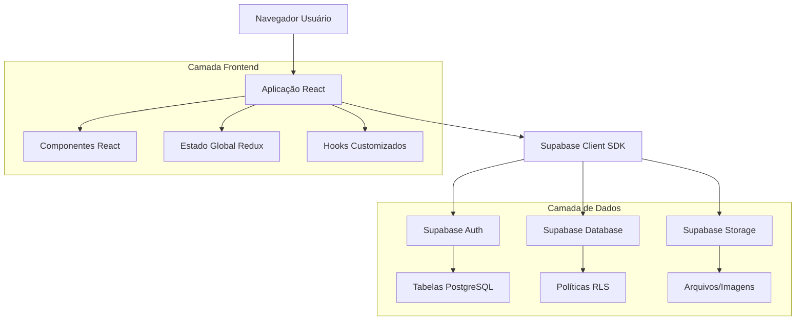
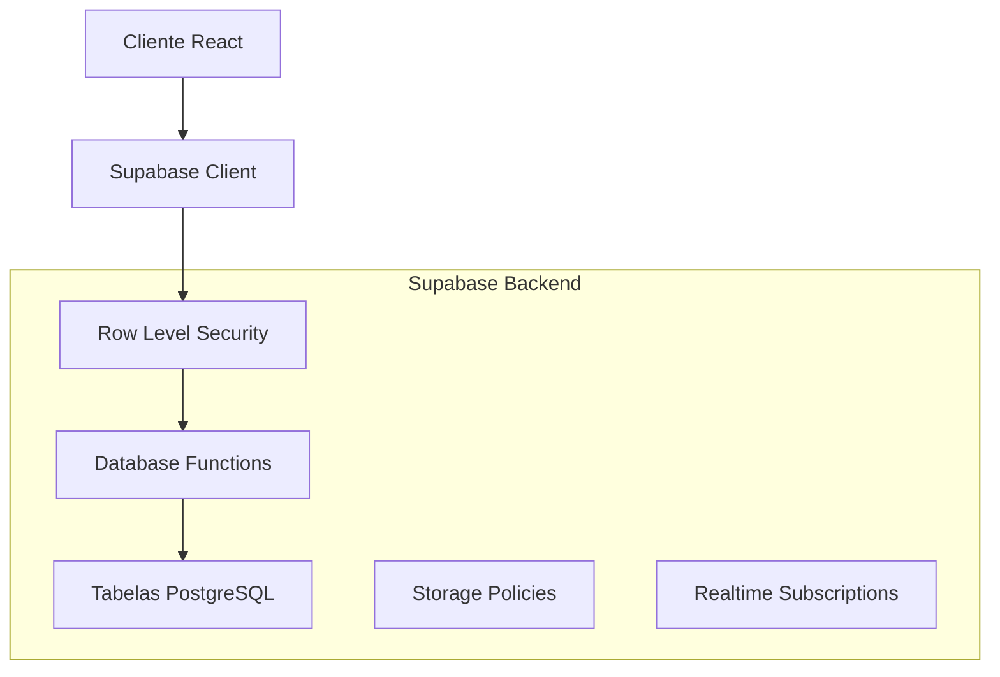
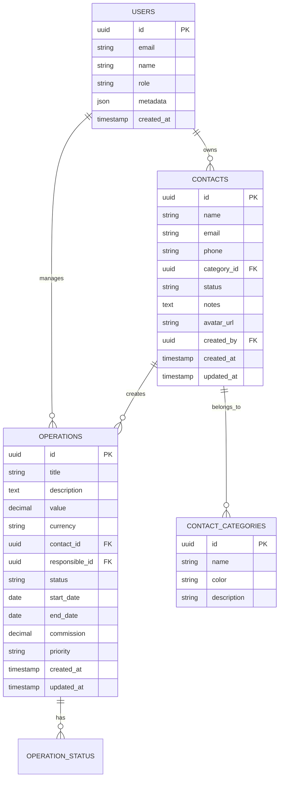

## 1. Arquitetura do Sistema



## 2. Tecnologias Utilizadas

- **Frontend**: React@18 + Redux Toolkit + React Query
- **Estilização**: Tailwind CSS + Styled Components
- **UI Components**: Material-UI + React Icons
- **Inicialização**: Vite
- **Backend**: Supabase (BaaS)
- **Banco de Dados**: PostgreSQL via Supabase
- **Autenticação**: Supabase Auth (RLS)
- **Validação**: React Hook Form + Yup
- **Tabelas**: React Table + TanStack Table

## 3. Definições de Rotas

| Rota | Finalidade |
|------|------------|
| /dashboard | Página inicial com visão geral das tabelas |
| /contacts | Lista de contatos com filtros e paginação |
| /contacts/new | Formulário para criar novo contato |
| /contacts/:id | Formulário para editar contato existente |
| /operations | Lista de operações com filtros avançados |
| /operations/new | Formulário para criar nova operação |
| /operations/:id | Formulário para editar operação existente |
| /settings | Configurações do sistema e preferências |

## 4. Definições de API

### 4.1 API de Contatos

**Listar Contatos com Filtros**
```
GET /api/contacts
```

Query Parameters:
| Parâmetro | Tipo | Obrigatório | Descrição |
|------------|------|-------------|-----------|
| page | number | false | Número da página (default: 1) |
| limit | number | false | Itens por página (default: 10) |
| search | string | false | Busca por nome/email |
| category | string | false | Filtrar por categoria |
| status | string | false | Filtrar por status |
| sortBy | string | false | Ordenar por campo |
| sortOrder | string | false | 'asc' ou 'desc' |

**Criar Contato**
```
POST /api/contacts
```

Request Body:
| Campo | Tipo | Obrigatório | Descrição |
|-------|------|-------------|-----------|
| name | string | true | Nome completo do contato |
| email | string | true | Email válido |
| phone | string | false | Telefone com formato |
| category | string | true | Categoria do contato |
| status | string | true | Status inicial |
| notes | string | false | Observações |
| avatar_url | string | false | URL da imagem |

### 4.2 API de Operações

**Listar Operações**
```
GET /api/operations
```

Query Parameters:
| Parâmetro | Tipo | Obrigatório | Descrição |
|------------|------|-------------|-----------|
| page | number | false | Número da página |
| limit | number | false | Itens por página |
| startDate | string | false | Data inicial (ISO) |
| endDate | string | false | Data final (ISO) |
| status | string | false | Filtrar por status |
| minValue | number | false | Valor mínimo |
| maxValue | number | false | Valor máximo |
| responsible | string | false | ID do responsável |

**Atualizar Status em Massa**
```
PATCH /api/operations/bulk-status
```

Request Body:
```json
{
  "operationIds": ["id1", "id2"],
  "newStatus": "completed"
}
```

## 5. Arquitetura do Servidor



## 6. Modelo de Dados

### 6.1 Diagrama de Entidades



### 6.2 Definição de Tabelas (DDL)

**Tabela de Contatos**
```sql
-- Criar tabela de contatos
CREATE TABLE contacts (
    id UUID PRIMARY KEY DEFAULT gen_random_uuid(),
    name VARCHAR(255) NOT NULL,
    email VARCHAR(255) UNIQUE NOT NULL,
    phone VARCHAR(50),
    category_id UUID REFERENCES contact_categories(id),
    status VARCHAR(50) DEFAULT 'active',
    notes TEXT,
    avatar_url TEXT,
    created_by UUID REFERENCES auth.users(id),
    created_at TIMESTAMP WITH TIME ZONE DEFAULT NOW(),
    updated_at TIMESTAMP WITH TIME ZONE DEFAULT NOW()
);

-- Índices para performance
CREATE INDEX idx_contacts_email ON contacts(email);
CREATE INDEX idx_contacts_category ON contacts(category_id);
CREATE INDEX idx_contacts_status ON contacts(status);
CREATE INDEX idx_contacts_created_by ON contacts(created_by);
```

**Tabela de Operações**
```sql
-- Criar tabela de operações
CREATE TABLE operations (
    id UUID PRIMARY KEY DEFAULT gen_random_uuid(),
    title VARCHAR(255) NOT NULL,
    description TEXT,
    value DECIMAL(15,2) NOT NULL,
    currency VARCHAR(3) DEFAULT 'BRL',
    contact_id UUID REFERENCES contacts(id),
    responsible_id UUID REFERENCES auth.users(id),
    status VARCHAR(50) DEFAULT 'pending',
    start_date DATE,
    end_date DATE,
    commission DECIMAL(5,2) DEFAULT 0.00,
    priority VARCHAR(20) DEFAULT 'medium',
    created_at TIMESTAMP WITH TIME ZONE DEFAULT NOW(),
    updated_at TIMESTAMP WITH TIME ZONE DEFAULT NOW()
);

-- Índices para performance
CREATE INDEX idx_operations_contact ON operations(contact_id);
CREATE INDEX idx_operations_responsible ON operations(responsible_id);
CREATE INDEX idx_operations_status ON operations(status);
CREATE INDEX idx_operations_dates ON operations(start_date, end_date);
CREATE INDEX idx_operations_value ON operations(value);
```

**Tabela de Categorias**
```sql
-- Criar tabela de categorias
CREATE TABLE contact_categories (
    id UUID PRIMARY KEY DEFAULT gen_random_uuid(),
    name VARCHAR(100) NOT NULL UNIQUE,
    color VARCHAR(7) DEFAULT '#0073ea',
    description TEXT,
    created_at TIMESTAMP WITH TIME ZONE DEFAULT NOW()
);

-- Inserir categorias padrão
INSERT INTO contact_categories (name, color, description) VALUES
    ('Cliente', '#00c875', 'Clientes principais'),
    ('Fornecedor', '#579bfc', 'Fornecedores e parceiros'),
    ('Lead', '#ffcb00', 'Potenciais clientes'),
    ('Parceiro', '#9b59b6', 'Parceiros de negócios');
```

### 6.3 Políticas de Segurança (RLS)

**Políticas para Contatos**
```sql
-- Permitir leitura para usuários autenticados
ALTER TABLE contacts ENABLE ROW LEVEL SECURITY;

CREATE POLICY "Usuários podem ver todos os contatos" ON contacts
    FOR SELECT USING (true);

CREATE POLICY "Usuários podem criar contatos" ON contacts
    FOR INSERT WITH CHECK (auth.uid() = created_by);

CREATE POLICY "Usuários podem atualizar próprios contatos" ON contacts
    FOR UPDATE USING (auth.uid() = created_by);

CREATE POLICY "Administradores podem gerenciar todos" ON contacts
    FOR ALL USING (EXISTS (
        SELECT 1 FROM auth.users 
        WHERE auth.users.id = auth.uid() 
        AND auth.users.raw_user_meta_data->>'role' = 'admin'
    ));
```

**Políticas para Operações**
```sql
-- Permitir leitura para usuários autenticados
ALTER TABLE operations ENABLE ROW LEVEL SECURITY;

CREATE POLICY "Usuários podem ver operações" ON operations
    FOR SELECT USING (true);

CREATE POLICY "Responsáveis podem gerenciar operações" ON operations
    FOR ALL USING (auth.uid() = responsible_id);

CREATE POLICY "Administradores podem gerenciar todas" ON operations
    FOR ALL USING (EXISTS (
        SELECT 1 FROM auth.users 
        WHERE auth.users.id = auth.uid() 
        AND auth.users.raw_user_meta_data->>'role' = 'admin'
    ));
```

## 7. Componentes React Principais

### 7.1 Estrutura de Componentes
```
src/
├── components/
│   ├── tables/
│   │   ├── DataTable.jsx          # Componente base reutilizável
│   │   ├── ContactTable.jsx       # Tabela específica de contatos
│   │   ├── OperationTable.jsx     # Tabela específica de operações
│   │   ├── TableToolbar.jsx       # Barra de ferramentas com filtros
│   │   └── TablePagination.jsx    # Controle de paginação
│   ├── modals/
│   │   ├── ContactModal.jsx       # Modal CRUD para contatos
│   │   ├── OperationModal.jsx     # Modal CRUD para operações
│   │   └── ConfirmModal.jsx       # Modal de confirmação
│   ├── forms/
│   │   ├── ContactForm.jsx        # Formulário de contato
│   │   ├── OperationForm.jsx      # Formulário de operação
│   │   └── FormValidation.js      # Validações comuns
│   └── common/
│       ├── LoadingSpinner.jsx     # Indicador de carregamento
│       ├── ErrorBoundary.jsx      # Tratamento de erros
│       └── StatusBadge.jsx        # Badges de status coloridos
```

### 7.2 Hooks Customizados
```javascript
// useTableData.js - Hook para gerenciar dados da tabela
const useTableData = (tableName, filters, pagination) => {
    const [data, setData] = useState([]);
    const [loading, setLoading] = useState(true);
    const [error, setError] = useState(null);
    const [total, setTotal] = useState(0);
    
    // Implementação com React Query e Supabase
};

// useTableFilters.js - Hook para gerenciar filtros
const useTableFilters = () => {
    const [filters, setFilters] = useState({});
    const [sortBy, setSortBy] = useState(null);
    const [sortOrder, setSortOrder] = useState('asc');
    
    // Lógica de filtros e ordenação
};
```