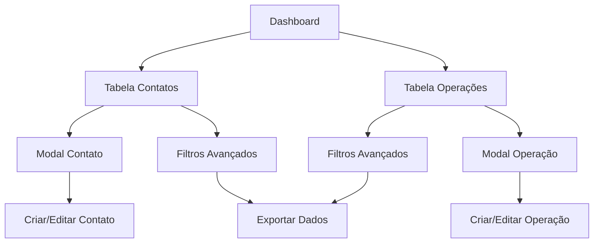

## 1. Visão Geral do Produto

Sistema de gerenciamento de tabelas responsivas para contact e operations, oferecendo interface intuitiva com filtros avançados, ordenação, paginação e modais CRUD. Inspirado no design moderno e funcionalidade do Monday.com, adaptado para necessidades específicas de gestão de contatos e operações.

O produto visa resolver problemas de organização e acesso rápido a informações críticas de negócios, permitindo que equipes gerenciem eficientemente contatos e operações com interface consistente e fluxos otimizados.

## 2. Funcionalidades Principais

### 2.1 Papéis de Usuário
| Papel | Método de Registro | Permissões Principais |
|-------|-------------------|----------------------|
| Usuário Padrão | Registro por email | Visualizar, criar, editar e excluir próprios registros |
| Administrador | Convite/Upgrade | Gerenciar todos os registros, configurar sistema e usuários |
| Visualizador | Convite | Apenas visualizar registros e exportar dados |

### 2.2 Módulos de Funcionalidades

Nosso sistema de tabelas consiste nas seguintes páginas principais:

1. **Tabela de Contatos**: Listagem completa de contatos com filtros por categoria, status e dados de contato.
2. **Tabela de Operações**: Gerenciamento de operações com status, datas, valores e responsáveis.
3. **Modal de Contato**: Formulário completo para criar/editar contatos com todos os campos necessários.
4. **Modal de Operação**: Interface para gerenciar detalhes de operações com validações e cálculos automáticos.
5. **Dashboard de Resumo**: Visão geral com estatísticas e gráficos das tabelas.

### 2.3 Detalhes das Páginas

| Nome da Página | Módulo | Descrição das Funcionalidades |
|----------------|---------|-------------------------------|
| Tabela de Contatos | Barra de Ferramentas | Pesquisa em tempo real, filtros por categoria/status, botões de ação rápida. |
| Tabela de Contatos | Cabeçalho da Tabela | Colunas ordenáveis: Nome, Email, Telefone, Categoria, Status, Data de Criação. |
| Tabela de Contatos | Corpo da Tabela | Linhas com hover effects, checkbox para seleção múltipla, ações inline. |
| Tabela de Contatos | Paginação | Controle de itens por página (10, 25, 50, 100), navegação por páginas. |
| Tabela de Operações | Barra de Ferramentas | Filtros por data, status, valor, responsável, exportação de dados. |
| Tabela de Operações | Cabeçalho da Tabela | Colunas: ID, Título, Cliente, Valor, Status, Data, Responsável. |
| Tabela de Operações | Corpo da Tabela | Status coloridos, valores formatados, badges de prioridade. |
| Modal Contato | Formulário | Campos para nome, email, telefone, categoria, observações, upload de arquivo. |
| Modal Contato | Validações | Validação em tempo real de email, telefone, campos obrigatórios. |
| Modal Operação | Formulário | Campos para título, descrição, valor, datas, status, responsável. |
| Modal Operação | Cálculos | Cálculo automático de comissões, totais, validação de datas. |

## 3. Fluxos Principais

### Fluxo de Usuário Padrão
1. Usuário acessa a tabela de contatos através do menu principal
2. Visualiza lista com filtros pré-aplicados (ativo por padrão)
3. Usa barra de pesquisa para encontrar contato específico
4. Aplica filtros adicionais por categoria ou status conforme necessário
5. Clica em "Novo Contato" para adicionar novo registro
6. Preenche formulário com validação em tempo real
7. Salva e retorna para tabela com novo registro listado

### Fluxo de Administrador
1. Acessa dashboard com visão geral de ambas as tabelas
2. Navega para tabela de operações com todos os filtros disponíveis
3. Aplica filtros complexos por período, status e valores
4. Exporta dados filtrados para relatórios
5. Edita múltiplos registros usando seleção em massa
6. Configura permissões e visualiza logs de atividades

## 4. Design de Interface

### 4.1 Estilo Visual
- **Cores Primárias**: Azul #0073ea (inspirado no Monday)
- **Cores Secundárias**: Verde #00c875 para status positivos, Vermelho para alertas
- **Botões**: Estilo arredondado com hover effects suaves
- **Fonte**: Figtree/Poppins para títulos, Roboto para corpo
- **Layout**: Card-based com sombras sutis #c3c6d4
- **Ícones**: React Icons com consistência visual

### 4.2 Visão Geral das Páginas

| Nome da Página | Módulo | Elementos de UI |
|----------------|---------|-----------------|
| Tabela Contatos | Header | Logo sistema, menu navegação, avatar usuário, notificações |
| Tabela Contatos | Toolbar | Search box com ícone, dropdown filtros, botão novo contato |
| Tabela Contatos | Tabela | Headers sortáveis com ícones, linhas com hover #f4f5f8, zebra striping |
| Tabela Contatos | Paginação | Info "Mostrando X de Y", botões nav, seletor items/página |
| Tabela Operações | Toolbar | Filtros data (date picker), dropdown status, campo valor |
| Tabela Operações | Tabela | Badges coloridos status, valores formatados BRL, coluna ações |
| Modal Contato | Header | Título modal, botão fechar X, subtítulo instruções |
| Modal Contato | Form | Labels acima campos, validação visual, botões Salvar/Cancelar |
| Modal Operação | Form | Grid 2 colunas, calculadora inline, preview valores |

### 4.3 Responsividade
- **Desktop-first**: Design otimizado para telas grandes (1920px+)
- **Breakpoints**: Mobile 460px, Tablet 720px, Desktop 960px+
- **Mobile**: Menu hambúrguer, tabelas scroll horizontal, cards empilhados
- **Touch**: Botões maiores 44px, gestos swipe para ações, teclado numérico para valores
- **Adaptação**: Colunas ocultáveis, priorização informações críticas em telas pequenas